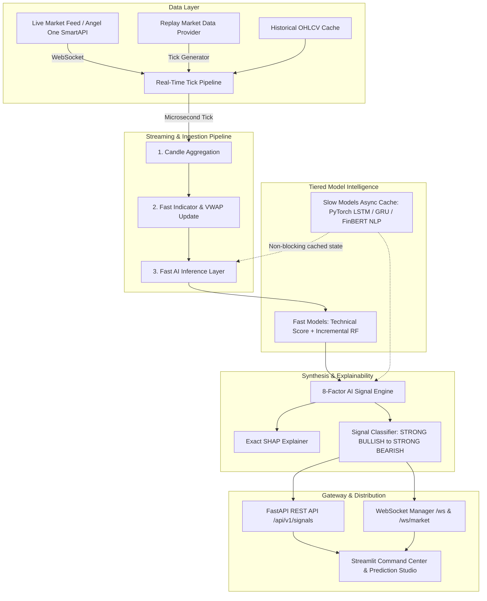

# StockMind-AI

> **Institutional-Grade Real-Time AI Market Intelligence & Quantitative Analytics Terminal**
> *Strictly anchored and executed from USB Drive: `D:\StockMind-AI`*

---

## 1. Project Overview

**StockMind-AI** is an institutional market intelligence, quantitative analytics, and real-time algorithmic decision-support terminal designed for the Indian equity markets (NSE / BSE) and global asset benchmarks.

The platform synthesizes **8 distinct analytical dimensions** into actionable, high-conviction market signals (`STRONG BULLISH`, `BULLISH`, `NEUTRAL`, `BEARISH`, `STRONG BEARISH`) accompanied by exact mathematical attribution using **SHAP (SHapley Additive exPlanations)**.

### Core Capabilities:
- **Real-Time Streaming Engine**: Sub-millisecond tick ingestion, incremental VWAP & OHLCV bar rollups, and live WebSocket broadcasts.
- **Quantitative Technical Analysis**: 20+ algorithmic indicators including moving average ribbons (SMA/EMA 20, 50, 100, 200), RSI, MACD, Bollinger Bands, ATR, ADX, Stochastic Oscillator, OBV, VWAP, support/resistance, Fibonacci retracements, candlestick patterns, and an AI Technical Score (0–100).
- **Time-Series Machine Learning**: Chronological, lookahead-free training of Random Forests, XGBoost, LightGBM, Logistic Regression, and Support Vector Machines with strict time-series cross-validation.
- **Deep Learning Sequence Forecasting**: PyTorch-based sequential LSTM and Gated Recurrent Unit (GRU) architectures with Monte Carlo Dropout uncertainty estimation.
- **Financial NLP & Sentiment Intelligence**: Entity recognition for NSE/BSE tickers, FinBERT sentiment scoring, and an AI Market Copilot with epistemic taxonomy.
- **Institutional Risk Engine**: Value at Risk (VaR 95/99 Parametric & Historical), Expected Shortfall (CVaR), Maximum Drawdown, Sharpe Ratio, Sortino Ratio, Beta, and Herfindahl-Hirschman (HHI) concentration metrics.
- **Unsupervised Anomaly Detection**: Isolation Forests detecting price spikes, volume surges, volatility anomalies, and price-volume divergences with automated severity classification.
- **Market Regime Classification**: Algorithmic classification into Bull, Bear, Sideways, or High-Volatility states.
- **Portfolio Optimization & Walk-Forward Backtesting**: Modern Portfolio Theory (MPT) Markowitz Efficient Frontier simulations and walk-forward strategy backtests.
- **Explainable AI (XAI)**: Exact Shapley efficiency ($\sum \phi_i = f(x) - \mathbb{E}[f(X)]$) attributing positive and negative feature drivers.

---

## 2. System Architecture



### Decoupled Execution Invariant
Expensive deep learning models (PyTorch LSTM/GRU) and Transformer NLP pipelines take 50–200ms per inference and **never execute in the synchronous live tick loop**. Heavy models update on scheduled intervals, caching output states into `_slow_model_cache`. On each live tick arrival, the fast inference pipeline performs microsecond feature updates and linear combination weighting.

---

## 3. Complete Folder Structure

```
D:\StockMind-AI\
├── .env                              # Active environment configuration (never committed)
├── .env.example                      # Complete development configuration template
├── .env.production.example           # Production deployment configuration template
├── .gitignore                        # Git exclusion rules (secrets, venv, databases, caches)
├── docker-compose.yml                # Docker multi-container composition
├── requirements.txt                  # Python 3.11 pinned dependencies
├── README.md                         # Institutional documentation guide
│
├── ai_engine\                        # Quantitative AI, Machine Learning & Deep Learning
│   ├── anomaly\                      # Isolation Forest & price-volume anomaly detection
│   ├── backtesting\                  # Walk-forward backtesting engine & performance metrics
│   ├── deep_learning\                # PyTorch LSTM, GRU, sequence datasets, and checkpointing
│   ├── explainability\               # Exact Shapley attribution (SHAP) & feature importance
│   ├── feature_engineering\          # 20+ technical indicators, VWAP, Candlesticks, AI Score
│   ├── ml\                           # Scikit-learn pipelines, ensembles, model registry
│   ├── nlp\                          # FinBERT sentiment, news processor, summarizer, Copilot
│   ├── portfolio\                    # Modern Portfolio Theory (MPT) optimizer & risk analytics
│   ├── regime\                       # Market regime classification (Bull, Bear, Sideways, Volatile)
│   ├── risk\                         # VaR, Expected Shortfall, Drawdown, Sharpe, Sortino, Beta
│   └── signals\                      # Final AI Signal Engine & Real-Time Tick Pipeline
│
├── backend\                          # FastAPI Core Gateway & WebSockets
│   ├── Dockerfile                    # Production backend container build
│   └── app\
│       ├── api\routes\               # REST endpoints (auth, market, ml, signals, health, etc.)
│       ├── config.py                 # Pydantic Settings & USB environment validator
│       ├── database.py               # Async SQLAlchemy engine & session management
│       ├── main.py                   # Application lifespan, CORS, error handlers, WebSockets
│       └── services\market\          # Market provider abstraction (Live vs Replay), WS manager
│
├── frontend\                         # Streamlit Institutional Terminal
│   ├── Dockerfile                    # Production frontend container build
│   ├── app.py                        # Terminal entrypoint, navigation, and state init
│   ├── components\                   # Header, ticker tapes, metric badges, telemetry cards
│   ├── pages\                        # Command Center, Live Market, Stock Analysis, AI Prediction,
│   │                                 # Technical Analysis, News Sentiment, Risk, Portfolio
│   ├── services\api_client.py        # Resilient backend API client with local fallbacks
│   └── utils\state.py                # Session state caching and watchlist synchronizers
│
├── database\                         # Persistence Layer
│   ├── stockmind.db                  # Local SQLite database file on USB
│   ├── migrations\                   # Alembic database migration scripts
│   └── models\                       # SQLAlchemy ORM models (User, Watchlist, Position, Order)
│
├── data\                             # Data Stores
│   ├── raw\                          # Historical CSV dumps and tick recordings
│   ├── processed\                    # Scaled, cleaned time-series features
│   └── cache\                        # In-memory and disk intermediate query cache
│
├── models\                           # Model Registry Serialized Artifacts (.joblib, .pt)
├── logs\                             # Rolling structured execution logs
└── tests\                            # 153 Comprehensive Automated Tests (100% Pass Rate)
    ├── test_auth.py                  # JWT authentication, registration, access tokens
    ├── test_database.py              # SQLite async session, ORM models, relations
    ├── test_deep_learning.py         # PyTorch LSTM, GRU, uncertainty, hybrid ensemble
    ├── test_explainability_and_signals.py # SHAP efficiency, 8-factor signal synthesis
    ├── test_final_audit.py           # Configuration validation, USB isolation, full audit
    ├── test_market_*.py              # Market APIs, replay feeds, WebSocket streaming
    ├── test_ml_engine.py             # Feature selection, train/test split, models
    ├── test_nlp_and_copilot.py       # FinBERT sentiment, entity matching, Copilot
    ├── test_risk_anomaly_portfolio_backtest.py # VaR, anomalies, regimes, MPT, backtests
    └── test_technical_analysis.py    # 20+ technical indicators, AI Technical Score
```

---

## 4. USB Installation

### Root Location
The system is built to operate **directly from the USB drive**:
```
D:\StockMind-AI
```

### Strict USB Storage Constraints
- **Zero Host Pollution**: All database files (`database/stockmind.db`), machine learning weights (`models/`), caches (`data/cache/`), and log files (`logs/`) are created strictly within `D:\StockMind-AI`. No files are written to `C:\Users\...` or host system directories.
- **Drive Letter Consistency**: The USB drive must be mounted as drive letter `D:`. If Windows assigns a different drive letter, reassign it using Windows Disk Management (`diskmgmt.msc`).
- **Relative Path Resolution**: All internal modules anchor file paths using `Path(__file__).resolve().parents[...]` to guarantee portability across machines.

---

## 5. Python 3.11 Setup

StockMind-AI requires **Python 3.11 (64-bit)** for scientific library stability (NumPy 1.26+, Scikit-Learn 1.5.2, PyTorch, SciPy, and SHAP).

### Verification
```powershell
py -3.11 --version
# Expected output: Python 3.11.x
```

If Python 3.11 is not installed, install it from the official [Python website](https://www.python.org/downloads/) ensuring *"Add Python to PATH"* is checked.

---

## 6. Virtual Environment Activation

The isolated virtual environment is located at `D:\StockMind-AI\.venv`.

### Windows PowerShell (Recommended)
```powershell
Set-ExecutionPolicy -ExecutionPolicy RemoteSigned -Scope Process
.\.venv\Scripts\Activate.ps1
```

### Windows Command Prompt (`cmd.exe`)
```cmd
.\.venv\Scripts\activate.bat
```

### Verification
```powershell
(Get-Command python).Source
# Expected output: D:\StockMind-AI\.venv\Scripts\python.exe
```

---

## 7. Environment Variables

Create your `.env` configuration file from `.env.example`:
```powershell
Copy-Item .env.example .env
```

### Configuration Parameters
| Parameter | Default | Description |
| :--- | :--- | :--- |
| `ENVIRONMENT` | `development` | Runtime environment (`development`, `production`, `testing`) |
| `DEBUG` | `true` | FastAPI debug exception traces |
| `BACKEND_HOST` | `127.0.0.1` | Gateway bind host |
| `BACKEND_PORT` | `8000` | FastAPI HTTP/WebSocket port |
| `FRONTEND_PORT` | `8501` | Streamlit Terminal port |
| `SECRET_KEY` | *Hex string* | Cryptographic signing key for JWT tokens |
| `DATABASE_TYPE` | `sqlite` | Persistence backend (`sqlite` or `postgresql`) |
| `SQLITE_DB_PATH` | `database/stockmind.db` | Relative SQLite database path on USB |
| `DATABASE_URL` | `sqlite+aiosqlite:///./database/stockmind.db` | Async SQLAlchemy connection URL |
| `MARKET_DATA_MODE` | `REPLAY` | Operational data feed: `REPLAY` or `LIVE` |
| `MARKET_DATA_PROVIDER`| `REPLAY` | Provider adapter (`REPLAY`, `ANGELONE`, `ZERODHA`) |
| `MARKET_API_KEY` | *(blank)* | Broker API key for LIVE mode |
| `MARKET_ACCESS_TOKEN` | *(blank)* | Broker daily session access token |
| `LOG_LEVEL` | `INFO` | Logging verbosity (`DEBUG`, `INFO`, `WARNING`, `ERROR`) |

---

## 8. Database Setup

StockMind-AI utilizes asynchronous SQLAlchemy with automatic table bootstrapping on startup.

### Local SQLite on USB (Default)
In development, the database automatically initializes at `D:\StockMind-AI\database\stockmind.db`. Zero manual SQL installation or configuration is required.

To verify database schema programmatically:
```powershell
.\.venv\Scripts\python.exe -c "import asyncio; from backend.app.database import check_db_connection; print('DB Connected:', asyncio.run(check_db_connection()))"
```

### Optional PostgreSQL
For production deployments, configure `DATABASE_TYPE=postgresql` and point `DATABASE_URL` to your PostgreSQL 16 instance.

---

## 9. Market Data Provider Setup

StockMind-AI implements a strict provider abstraction layer (`BaseMarketDataProvider`):

```
       BaseMarketDataProvider (Abstract Interface)
               │
       ┌───────┴────────────────────────┐
       ▼                                ▼
ReplayMarketDataProvider     LiveBrokerMarketDataProvider
(Self-contained, offline)    (Angel One / Zerodha SmartAPI)
```

The system automatically switches between providers based on `MARKET_DATA_MODE` in `.env`.

---

## 10. LIVE Mode Configuration

To stream live market data from Indian stock exchanges (NSE / BSE):

1. **Broker Registration**:
   - Register on the [Angel One SmartAPI Developer Portal](https://smartapi.angelone.in/) or [Zerodha Kite Developer](https://kite.trade/).
   - Generate your **API Key**, **API Secret**, and **Client Code**.
2. **Update `.env`**:
   ```env
   MARKET_DATA_MODE=LIVE
   MARKET_DATA_PROVIDER=ANGELONE
   MARKET_API_KEY=your_actual_smartapi_key
   MARKET_API_SECRET=your_actual_smartapi_secret
   MARKET_ACCESS_TOKEN=your_daily_session_jwt
   MARKET_WS_URL=wss://smartapisocket.angelone.in/smart-stream
   ```
3. **Daily TOTP Authentication**:
   - Broker compliance requires generating a daily session JWT using Time-based One-Time Password (TOTP). Run your broker authentication script before market hours (09:15 AM IST) to refresh `MARKET_ACCESS_TOKEN`.
4. **Graceful Fallback**:
   - If credentials are missing or expired, the backend automatically logs a warning and operates in `REPLAY` mode so the terminal remains fully usable.

---

## 11. REPLAY Mode (Default & Zero Credentials)

`REPLAY` mode requires **no external API keys, no internet connection, and no broker accounts**:
- Simulates live Indian equities (`RELIANCE`, `TCS`, `HDFCBANK`, `INFY`, `ICICIBANK`, `SBIN`, `TATAMOTORS`, `NIFTY 50`, `SENSEX`).
- Generates realistic tick intervals, order book depths, VWAP calculations, and intraday volatility.
- Accurately tests and validates the entire technical, ML, deep learning, and AI signal pipeline offline.
- Every data point carries an explicit **REPLAY DATA** provenance badge.

---

## 12. Frontend Startup

The terminal UI is built with Streamlit.

```powershell
cd D:\StockMind-AI
.\.venv\Scripts\Activate.ps1
streamlit run frontend\app.py --server.port 8501
```
Open your browser to: **`http://localhost:8501`**

### Available Studio Pages:
1. **Command Center**: Executive market summary, real-time pulse card, multi-ticker overview.
2. **Live Market**: Real-time tick stream, interactive candlestick chart, depth and order flow.
3. **Stock Analysis**: Deep-dive fundamental ratios, quarterly performance, valuation metrics.
4. **AI Prediction**:
   - Tab 1: Classical Machine Learning Studio (Random Forest, XGBoost, LightGBM, SVM).
   - Tab 2: Deep Learning Studio (PyTorch LSTM & GRU Multi-Step Forecaster).
   - Tab 3: Hybrid Ensemble & Agreement Matrix.
   - **Tab 4: Real-Time AI Signal Engine & SHAP Explainability Studio**.
5. **Technical Analysis**: 20+ indicators, candlestick pattern detection, AI Technical Score.
6. **News & Sentiment**: FinBERT sentiment scoring, news impact analysis, AI Market Copilot.
7. **Risk Intelligence**: VaR (95%/99%), Expected Shortfall, Maximum Drawdown, Sharpe/Sortino.
8. **Portfolio & Backtesting**: Holdings valuation, MPT Markowitz optimization, walk-forward simulations.

---

## 13. Backend Startup

Launch the FastAPI gateway:

```powershell
cd D:\StockMind-AI
.\.venv\Scripts\Activate.ps1
python -m uvicorn backend.app.main:app --host 127.0.0.1 --port 8000 --reload
```

- **Interactive Swagger Docs**: `http://127.0.0.1:8000/api/v1/docs`
- **ReDoc API Reference**: `http://127.0.0.1:8000/api/v1/redoc`
- **Top-Level Health Check**: `http://127.0.0.1:8000/health`
- **Comprehensive Subsystem & USB Audit**: `http://127.0.0.1:8000/api/v1/health/detailed`
- **Real-Time WebSocket Stream**: `ws://127.0.0.1:8000/ws`

---

## 14. Testing

The repository includes a comprehensive, multi-tiered test suite with **153 passing automated tests**:

```powershell
cd D:\StockMind-AI
.\.venv\Scripts\python.exe -m pytest tests/ -v
```

### Verified Test Categories:
- `test_auth.py`: JWT authentication, token hashing, user registration, route protection.
- `test_database.py`: Async SQLite engine, relationships, user portfolios, positions.
- `test_market_*.py`: Providers, replay loops, candlestick generation, WebSockets.
- `test_technical_analysis.py`: Indicators (SMA, EMA, RSI, MACD, Bollinger Bands, VWAP, etc.).
- `test_ml_engine.py`: Feature pipelines, lookahead-free splits, classifier metrics.
- `test_deep_learning.py`: PyTorch LSTM/GRU sequence inference, MC Dropout uncertainty, ensembles.
- `test_nlp_and_copilot.py`: FinBERT sentiment, ticker entity extraction, AI Copilot context.
- `test_risk_anomaly_portfolio_backtest.py`: VaR, CVaR, Isolation Forests, MPT, backtesting.
- `test_explainability_and_signals.py`: Exact Shapley efficiency axiom, 8-factor signal synthesis.
- `test_final_audit.py`: USB path isolation, configuration audit, live vs replay credential validation.

---

## 15. Docker Usage

Containerize and execute StockMind-AI using Docker Compose:

### Build and Launch Containers
```powershell
docker compose up --build -d
```

### Service Map:
- **FastAPI Backend**: `http://localhost:8000`
- **Streamlit Terminal**: `http://localhost:8501`
- **Database Health**: Automatically verified via container health checks.

### Shutdown
```powershell
docker compose down
```

---

## 16. AI Model Training

### Training Classical ML Models
```powershell
.\.venv\Scripts\python.exe -m ai_engine.ml.train --symbol RELIANCE --timeframe 1d
```
Trains Random Forest, Logistic Regression, and SVM classifiers on chronological features with zero lookahead bias and serializes model bundles into `models/`.

### Training Deep Learning Models (PyTorch LSTM / GRU)
```powershell
.\.venv\Scripts\python.exe -m ai_engine.deep_learning.train --symbol RELIANCE --epochs 50 --model lstm
```
Trains multi-layer recurrent sequence predictors with early stopping and checkpoints.

### Scheduled Retraining Invariant
> **CRITICAL**: Models are never retrained on live incoming market ticks. Retraining is executed offline on daily/weekly schedules to preserve system throughput and prevent overfitting to microstructure noise.

---

## 17. Model Storage

- Models are serialized to: `D:\StockMind-AI\models/`
- Every serialized model bundle includes:
  - Model weights / estimator object
  - Training timestamp & version string
  - Feature column names & scalers
  - Out-of-sample performance metrics (MAE, RMSE, F1, Accuracy)
- Tracked via `ai_engine.ml.model_registry.model_registry`.

---

## 18. Troubleshooting

### 1. `ModuleNotFoundError: No module named 'frontend'`
Ensure you launch Streamlit from `D:\StockMind-AI`:
```powershell
cd D:\StockMind-AI
streamlit run frontend\app.py
```

### 2. `InconsistentVersionWarning: Unpickling estimator from version 1.5.2`
StockMind-AI models were trained with `scikit-learn==1.5.2`. Verify that `.venv` has the pinned version:
```powershell
.\.venv\Scripts\pip.exe list | Select-String "scikit-learn"
# Expected: scikit-learn 1.5.2
```

### 3. Windows PowerShell Script Execution Policy Error
If PowerShell prevents activating `.venv`, run:
```powershell
Set-ExecutionPolicy -ExecutionPolicy RemoteSigned -Scope Process
```

### 4. Port Conflict on 8000 or 8501
Check for existing processes:
```powershell
netstat -ano | findstr :8000
netstat -ano | findstr :8501
```
Terminate stale tasks or configure `BACKEND_PORT` / `FRONTEND_PORT` in `.env`.

---

## 19. Security Rules

1. **Zero Hardcoded Secrets**: No API keys, client codes, or database credentials exist in source code.
2. **Git Safeguard**: The `.gitignore` file strictly blocks `.env`, `*.db`, `.venv/`, `models/*.pt`, `models/*.joblib`, and `logs/`.
3. **Cryptographic Authentication**: JWT signing uses HS256 with salted PBKDF2/Bcrypt password hashing.
4. **SQL Injection Prevention**: All queries execute through SQLAlchemy parameterized ORM calls.
5. **USB Confinement**: The configuration validator enforces that paths never escape `D:\StockMind-AI`.

---

## 20. Financial Risk Disclaimer

> ### ⚠️ Regulatory & Compliance Notice
>
> **StockMind-AI is an analytical quantitative research platform and mathematical modeling tool.**
>
> 1. **No Investment Advice**: Output signals (`STRONG BULLISH`, `BULLISH`, `NEUTRAL`, `BEARISH`, `STRONG BEARISH`), technical scores, and machine learning forecasts represent **probabilistic pattern classifications** and do **NOT** constitute financial advice, investment recommendations, or a solicitation to buy or sell securities.
> 2. **No Guaranteed Returns**: Quantitative models, deep learning networks, and historical backtests cannot guarantee future performance. Financial markets involve inherent volatility and substantial risk of capital loss.
> 3. **Independent Decision-Making**: Users must perform their own due diligence and consult licensed financial advisors before executing capital trades. The creators and contributors of StockMind-AI accept no liability for financial losses incurred through the use of this software.
